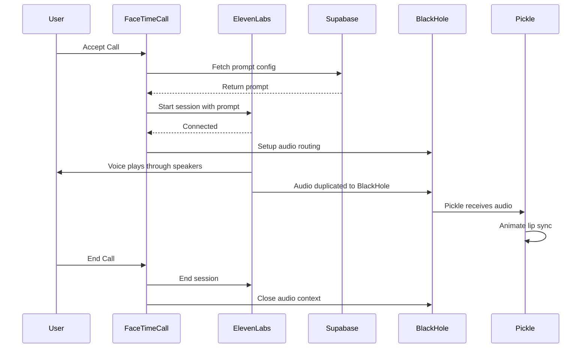

# FaceTime + Pickle + ElevenLabs Integration Setup Guide

## Overview

This implementation enables the following workflow:

1. **User accepts FaceTime call** → Triggers navigation to FaceTime call screen
2. **Pickle app is displayed** → Screen capture shows Pickle application window
3. **ElevenLabs voice connects** → AI voice agent starts speaking with configured prompt
4. **Audio routing** → Voice plays through speakers AND routes to BlackHole for Pickle
5. **Pickle animates** → Pickle app receives audio through BlackHole and animates lip movements
6. **Call ends** → ElevenLabs session closes, audio routing stops

## Features Implemented

### ✅ ElevenLabs Voice Integration
- Automatically connects to ElevenLabs when call is accepted
- Uses WebRTC for real-time voice communication
- Fetches custom prompts from Supabase database
- Voice connection status indicator in UI
- Automatic disconnection when call ends

### ✅ Audio Routing with BlackHole
- Duplicates audio to two destinations:
  - Default speakers (user hears the voice)
  - BlackHole virtual audio device (Pickle can listen for animation)
- Volume monitoring for debugging
- Clean cleanup on call end

### ✅ Supabase Prompt Configuration
- Fetches user-specific prompts from `user_prompts` table
- Falls back to default prompt if not found
- Supports customized warning messages per user

### ✅ Call Lifecycle Management
- Proper initialization on call start
- Clean resource cleanup on call end
- Screen capture pauses during FaceTime calls
- Main process aware of call state

## Prerequisites

### 1. Install BlackHole (Virtual Audio Device)

```bash
# Install via Homebrew
brew install blackhole-2ch

# Or download from GitHub
# https://github.com/ExistentialAudio/BlackHole
```

### 2. Configure macOS Audio MIDI Setup

1. Open **Audio MIDI Setup** app (in `/Applications/Utilities/`)
2. Click the **"+"** button in bottom-left corner
3. Select **"Create Multi-Output Device"**
4. In the Multi-Output Device settings:
   - ✅ Check **"Built-in Output"** (or your default speakers)
   - ✅ Check **"BlackHole 2ch"**
   - Set **"Built-in Output"** as the master device
5. (Optional) Rename the Multi-Output Device to "Speakers + BlackHole"

### 3. Set System Audio Output

1. Open **System Preferences** → **Sound** → **Output**
2. Select the **Multi-Output Device** you just created
3. All system audio will now play through speakers AND route to BlackHole

**Alternative:** Only set this Multi-Output Device during FaceTime calls by using a tool like [SwitchAudioSource](https://github.com/deweller/switchaudio-osx)

### 4. Configure Pickle App

1. Open Pickle application settings
2. Set **Audio Input Device** to **"BlackHole 2ch"**
3. Pickle will now receive the ElevenLabs voice audio for lip sync

### 5. Supabase Database Setup

Create the `user_prompts` table in your Supabase database:

```sql
CREATE TABLE user_prompts (
  id UUID DEFAULT gen_random_uuid() PRIMARY KEY,
  email TEXT NOT NULL UNIQUE,
  prompt TEXT NOT NULL,
  warning_message TEXT,
  created_at TIMESTAMP WITH TIME ZONE DEFAULT now(),
  updated_at TIMESTAMP WITH TIME ZONE DEFAULT now()
);

-- Create an index on email for faster lookups
CREATE INDEX idx_user_prompts_email ON user_prompts(email);

-- Example insert
INSERT INTO user_prompts (email, prompt, warning_message)
VALUES (
  'user@example.com',
  'You are Pickle, a friendly AI coach. During this session, remind the user to maintain good posture and take breaks every 25 minutes.',
  'Remember to sit up straight and stay hydrated!'
);
```

### 6. Environment Variables

Ensure your `.env` file has:

```bash
VITE_ELEVENLABS_AGENT_ID=your_agent_id_here
SUPABASE_URL=https://your-project.supabase.co
SUPABASE_ANON_KEY=your_anon_key_here
```

## How It Works

### Call Flow



### Audio Routing Architecture

```
┌─────────────────┐
│  ElevenLabs API │
│    (WebRTC)     │
└────────┬────────┘
         │
         ▼
┌─────────────────────────────┐
│   macOS Multi-Output Device │
└─────┬─────────────────┬─────┘
      │                 │
      ▼                 ▼
┌───────────┐    ┌──────────────┐
│  Speakers │    │ BlackHole 2ch│
│  (User    │    │  (Virtual    │
│   hears)  │    │   Audio)     │
└───────────┘    └──────┬───────┘
                        │
                        ▼
                 ┌──────────────┐
                 │  Pickle App  │
                 │ (Lip Sync    │
                 │  Animation)  │
                 └──────────────┘
```

## Files Modified

### Frontend (Renderer)
- **[FaceTimeCall.tsx](coach-electron/src/renderer/src/components/FaceTimeCall.tsx)**
  - Added ElevenLabs `useConversation` hook
  - Implemented `startVoiceConversation()` function
  - Added `setupAudioRouting()` for BlackHole integration
  - Added `getOutputVolume()` for volume monitoring
  - Updated `handleEndCall()` to close ElevenLabs session
  - Added voice connection status indicator

### Backend (Main Process)
- **[index.ts](coach-electron/src/main/lib/index.ts)**
  - Added `getPromptConfig()` function to fetch from Supabase
  - Returns default prompt if database query fails

- **[index.ts](coach-electron/src/main/index.ts)**
  - Added IPC handler for `getPromptConfig`

### IPC Bridge (Preload)
- **[index.ts](coach-electron/src/preload/index.ts)**
  - Exposed `getPromptConfig` to renderer process

- **[index.d.ts](coach-electron/src/preload/index.d.ts)**
  - Added TypeScript definitions for `getPromptConfig`

### Types
- **[types.ts](coach-electron/src/shared/types.ts)**
  - Added `PromptConfig` interface
  - Added `GetPromptConfigFn` type

## Usage

### Starting a Call

1. User triggers FaceTime call (via notification or manual trigger)
2. App automatically:
   - Captures Pickle app window
   - Fetches user's prompt from Supabase
   - Connects to ElevenLabs with configured prompt
   - Sets up audio routing to BlackHole
   - Starts voice conversation

### During Call

- Voice plays through speakers
- Pickle animates based on audio from BlackHole
- Volume is logged to console for debugging
- Voice connection status shown in top-left corner

### Ending Call

1. User presses "End Call" button
2. App automatically:
   - Ends ElevenLabs session
   - Closes audio context
   - Stops all video streams
   - Navigates back to dashboard

## Debugging

### Check Audio Routing

```bash
# List all audio devices
system_profiler SPAudioDataType

# Check if BlackHole is installed
ls /Library/Audio/Plug-Ins/HAL/BlackHole2ch.driver
```

### Console Logs

When a call starts, you should see:

```
ElevenLabs status: connecting
Loaded prompt config from Supabase: { prompt: "..." }
ElevenLabs voice session started
Audio routing setup complete
✓ ElevenLabs audio will play through default speakers
✓ Audio will also route to BlackHole (if Multi-Output Device is configured)
✓ Pickle can listen to BlackHole for lip sync animation
ElevenLabs status: connected
ElevenLabs output volume: 0.42
```

### Common Issues

**No audio playing:**
- Check if Multi-Output Device is selected in System Preferences → Sound
- Verify BlackHole is installed: `ls /Library/Audio/Plug-Ins/HAL/`

**Pickle not animating:**
- Check Pickle audio input is set to "BlackHole 2ch"
- Verify Multi-Output Device includes BlackHole
- Check volume logs in console

**Voice session not starting:**
- Verify `VITE_ELEVENLABS_AGENT_ID` is set in `.env`
- Check microphone permissions are granted
- Check console for error messages

## Future Enhancements

### Potential Improvements

1. **Dynamic Audio Device Switching**
   - Automatically switch to Multi-Output Device when call starts
   - Restore previous audio device when call ends
   - Use `SwitchAudioSource` library

2. **Volume Visualization**
   - Add visual volume indicator in UI
   - Real-time waveform display
   - Volume history graph

3. **Advanced Prompt Management**
   - UI for editing prompts directly in app
   - Multiple prompt templates
   - Context-aware prompts based on user activity

4. **Pickle Integration API**
   - Direct API integration with Pickle app
   - Send volume data via IPC instead of audio routing
   - Programmatic animation control

5. **Audio Quality Monitoring**
   - Detect audio dropouts
   - Monitor latency
   - Automatic quality adjustments

## Technical Notes

### Why BlackHole?

BlackHole is a virtual audio device that acts as a "pass-through" for audio. It allows applications to:
- Capture system audio that's playing
- Route audio between applications
- Create custom audio pipelines

Without BlackHole, there's no way for Pickle to "hear" the ElevenLabs voice output because macOS doesn't allow apps to capture other apps' audio output by default.

### Why Multi-Output Device?

A Multi-Output Device in macOS allows sending the same audio to multiple destinations simultaneously. Without it, you'd have to choose between:
- Playing audio through speakers (user hears it) OR
- Routing to BlackHole (Pickle can animate)

With Multi-Output Device, you get BOTH.

### ElevenLabs WebRTC

ElevenLabs uses WebRTC for real-time voice streaming. The audio is handled at the system level, which means:
- Low latency
- High quality
- Automatic echo cancellation
- Built-in noise suppression

The WebRTC connection automatically routes audio to the system's default output device, which is why we need to set the Multi-Output Device as the system default.

## Support

For issues or questions:
1. Check console logs for error messages
2. Verify all prerequisites are installed
3. Test each component individually:
   - BlackHole installation
   - Multi-Output Device creation
   - ElevenLabs connection
   - Supabase prompt fetching

## License

This implementation is part of the Coach application.
